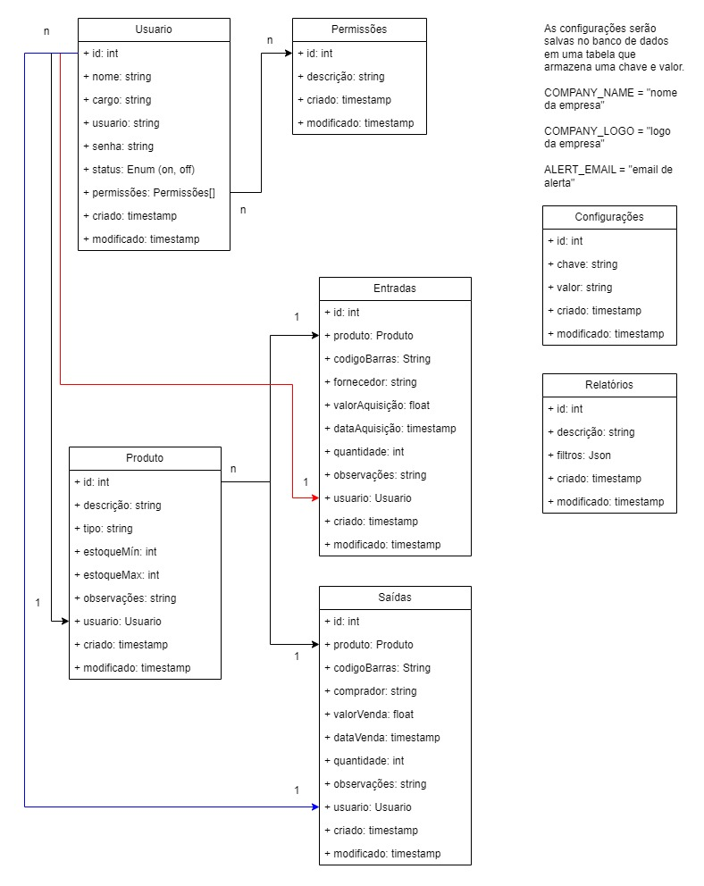

# G Inventory
Sistema de controle de estoque.

## Objetivos
- Acompanhar as entradas e saídas de estoque;
- Gerar relatórios sobre o estoque;
- Alertar sobre níveis baixos de estoque.

## Requisitos do sistema:
- O sistema deve ser capaz de registrar as entradas e saídas de estoque, incluindo informações sobre o produto, a quantidade e a data. 
- O sistema deve gerar relatórios sobre o estoque, incluindo informações sobre os produtos em estoque, os produtos com níveis baixos de estoque e os produtos com níveis de estoque excessivos. 
- O sistema deve enviar alertas sobre níveis baixos de estoque, incluindo informações sobre o produto, a quantidade necessária e a data de alerta.

## DER

## Tarefas
- [x] Criar models
- [x] Criar repositories
- [x] Criar services
- [x] Criar implementações dos serviços
- [x] Criar controllers
- [x] Configurar banco de dados
- [x] Configurar JWT
- [x] Configurar CORS
- [x] Criar crud de configurações
- [x] Criar testes
- [ ] Criar documentação da API
- [ ] Implementar notificações por e-mail
- [ ] Implementar a geração de relatório
- [ ] Testar no Postman/Swagger
